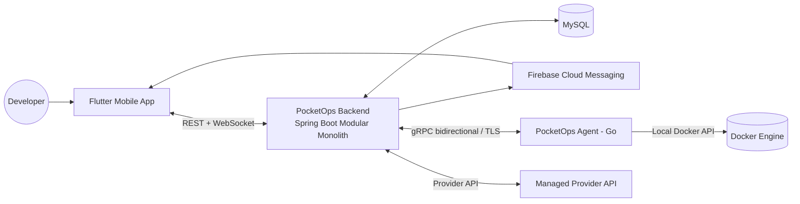
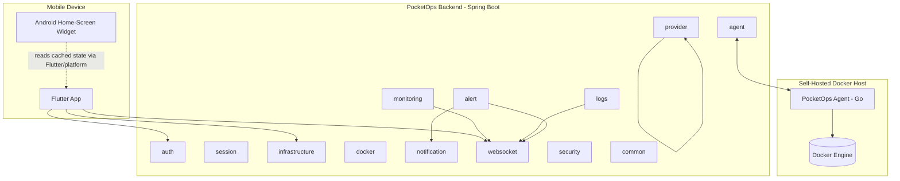
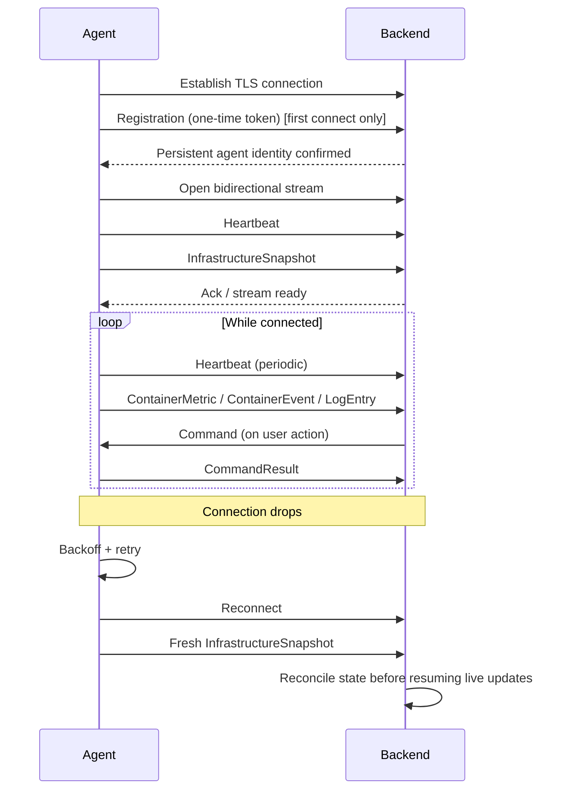
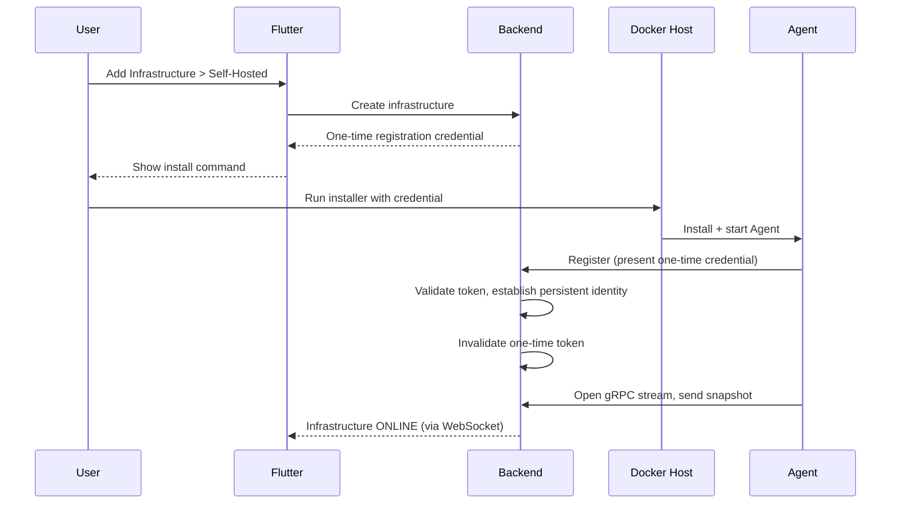
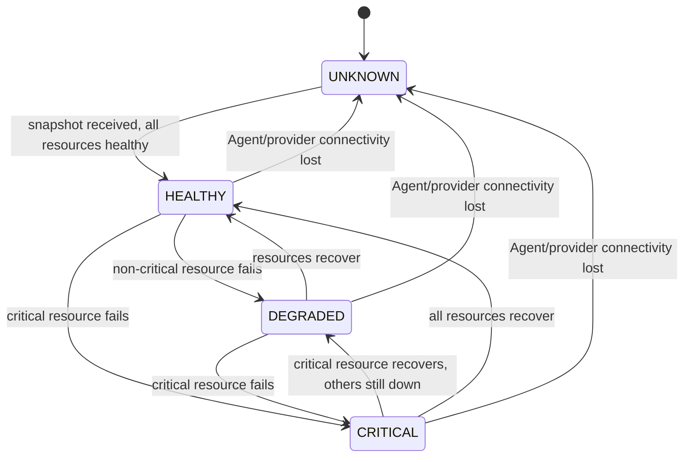
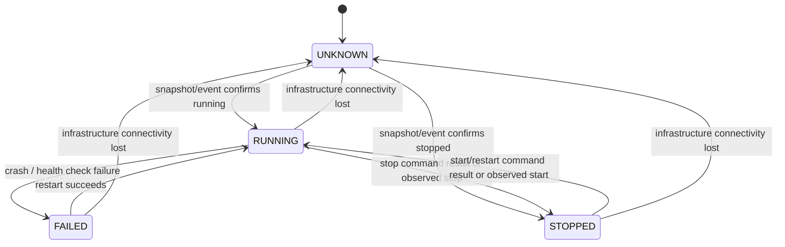
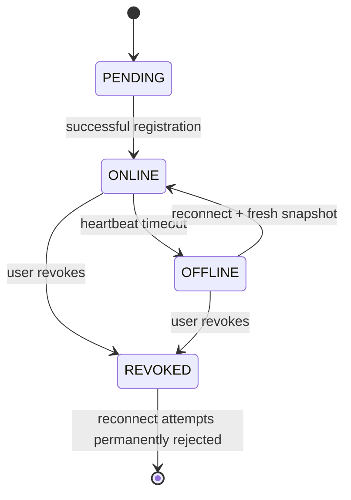
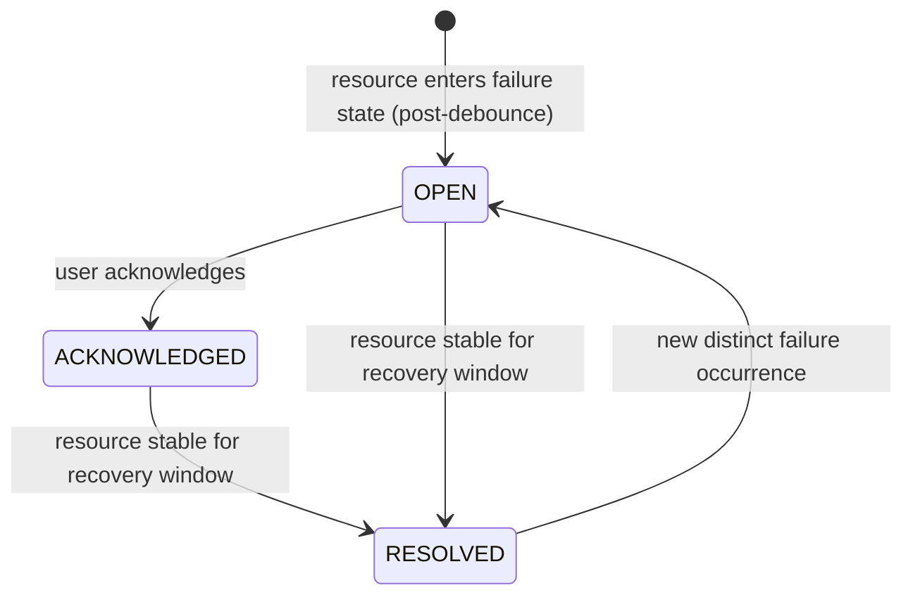
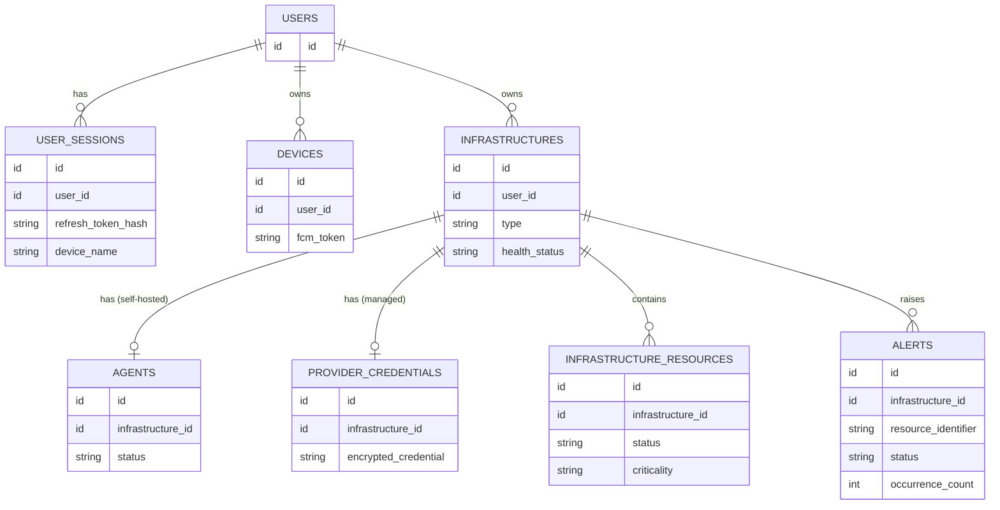
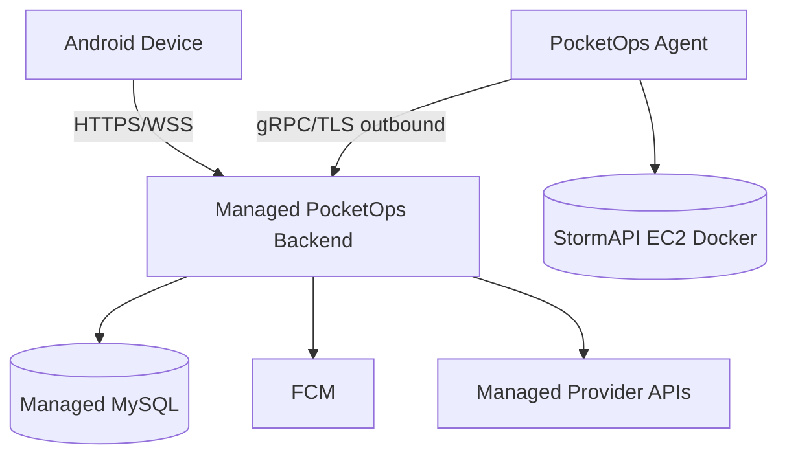

# PocketOps System Architecture

## How to Use This Document

This is the authoritative **system architecture**: how PocketOps is structured, how components communicate, and where trust and security boundaries sit. For product rationale see `PRD.md`. For implementation-level component behavior see `DESIGN.md`. For build order see `PHASES.md`. For non-negotiable constraints see `RULES.md`. For rapid AI context restoration see `MEMORY.md`.

**This architecture is FROZEN.** Do not redesign it. Do not introduce Kubernetes, Kafka, RabbitMQ, Prometheus, Grafana, ELK, Terraform, a time-series database, remote shell/`docker exec`, or additional microservices. See `RULES.md` for the full prohibited list.

---

## Architectural Goals

- Give a mobile client trustworthy, low-latency visibility into Dockerized infrastructure.
- Keep the monitored application completely unaware of PocketOps.
- Keep the backend a single deployable modular monolith rather than a distributed system.
- Represent infrastructure state truthfully, including when it is unknown or stale.
- Bound operational control to a small, safe, allow-listed command set.
- Support both self-hosted (Agent-based) and managed (provider-API-based) infrastructure through one unified capability model.

## Architecture Principles

- **Mobile-first**: the Flutter app is the primary product surface, not an afterthought.
- **Capability-driven**: UI and backend behavior are driven by what an infrastructure can actually do, never by hardcoded provider checks scattered through logic.
- **Application-agnostic monitoring**: the Agent never depends on, links against, or modifies the monitored application.
- **Least privilege**: the Agent and backend expose the minimum operations needed (inspect, stats, logs, start/stop/restart) and nothing resembling a general Docker API proxy.
- **Truthful state representation**: the system never presents stale data as live, or an unknown state as healthy/failed.
- **Bounded operational control**: exactly three destructive operations exist; there is no generic command channel.
- **Additive infrastructure onboarding**: registering, removing, or modifying one infrastructure never touches another.
- **Failure isolation**: an Agent, provider, or infrastructure failure is contained and does not cascade into unrelated infrastructures or crash the control plane.
- **Modular monolith**: one Spring Boot deployable, internally organized into clear modules with disciplined dependency direction, rather than premature microservices.
- **Avoid unnecessary infrastructure complexity**: no message broker, no time-series database, no container orchestration layer — this is a bounded MVP, not a hyperscale platform.

## System Context Diagram



## Container / Component Diagram



## Trust Boundaries

| Boundary | Description |
|---|---|
| **Mobile device ↔ Internet** | Untrusted network; all traffic to the backend is TLS (HTTPS/WSS). |
| **Internet ↔ PocketOps backend** | Backend authenticates every request; no endpoint trusts client-supplied identity without verification. |
| **PocketOps backend ↔ MySQL** | Trusted internal boundary; backend is the only component with database access. |
| **PocketOps backend ↔ Docker host (Agent)** | Untrusted network; mutual TLS-based identity verification required in both directions. |
| **Docker host ↔ Docker daemon** | Local-only; the Agent talks to the local Docker API and never exposes it externally. |
| **PocketOps backend ↔ Managed provider** | Backend holds encrypted provider credentials; provider API calls are outbound only. |

The **Docker daemon is always local to its host** and is never reachable from the public internet through any PocketOps component.

## Communication Matrix

| From | To | Protocol | Purpose |
|---|---|---|---|
| Flutter | Backend | REST (HTTPS) | Auth, sessions, infrastructure CRUD, agent registration UX, provider setup, container actions, alert acknowledgement, settings/profile, manual refresh |
| Flutter | Backend | WebSocket (WSS) | Live metrics, live logs, resource/infrastructure state changes, alert changes, agent state changes |
| Agent | Backend | gRPC bidirectional streaming (TLS) | Heartbeats, infrastructure snapshots, container state/metrics/events, logs, command dispatch, command results |
| Agent | Docker Engine | Local Docker API (Go Docker SDK) | Container discovery, stats, events, logs, start/stop/restart |
| Backend | MySQL | SQL / Spring Data JPA | Persistent state: users, sessions, infrastructures, agents, provider credentials, resources, alerts |
| Backend | FCM | HTTPS notification API | Android push delivery |
| Backend | Managed Provider | Provider-specific REST API | Status, metrics, logs, and control operations bounded by provider capability |

## Backend Modular Monolith

Single Spring Boot deployable. Modules and responsibilities:

```
backend/src/main/java/.../pocketops/
├── auth/            # login, registration, GitHub OAuth, password hashing
├── user/            # user profile/account
├── session/         # JWT issuance, refresh rotation, session revocation
├── infrastructure/  # infrastructure CRUD, ownership resolution, health aggregation
├── agent/           # agent registration, lifecycle, gRPC endpoint integration
├── provider/         # managed provider adapters and capability discovery
├── docker/           # translation layer between agent-reported Docker data and domain model
├── monitoring/       # metrics ingestion (streaming), infrastructure/resource state evaluation
├── logs/             # live log stream handling and fan-out
├── alert/            # alert lifecycle, debounce/flapping protection, auto-resolution
├── notification/     # FCM integration, deep-link payload construction
├── websocket/        # channel/topic management, per-user/per-infrastructure authorization
├── security/         # Spring Security config, JWT filters, ownership-enforcement helpers
└── common/           # shared DTOs, error model, utilities
```

**Dependency direction**: `infrastructure` is the central domain module; `agent`, `provider`, `docker`, `monitoring`, `logs`, and `alert` depend on it, not the reverse. `websocket` and `notification` are downstream consumers of state changes, not producers. `security` is a cross-cutting concern used by all inbound-facing modules. `common` has no dependencies on other modules. Modules must not form cycles; if module A needs something from module B and B needs something from A, the shared concept belongs in `common` or in a shared domain interface within `infrastructure`.

## Flutter Architecture

Feature-first structure:

```
lib/
  core/                # networking, theming, routing, shared widgets, secure storage
  features/
    auth/
    home/
    infrastructure/
    service_details/
    alerts/
    settings/
    onboarding/
```

Within each feature: a `data` layer (REST/WebSocket clients, DTOs), a light `domain`/application layer only where it adds real value (not ceremony), and a `presentation` layer (screens, widgets, Riverpod providers). PocketOps deliberately avoids heavy clean-architecture layering for its own sake — the goal is clarity, not ceremony.

**Riverpod's role**: Riverpod providers hold feature state (infrastructure list, live metrics, live logs, alert state) and mediate between REST/WebSocket data sources and the UI. Providers are scoped per feature; live-stream providers must be properly disposed when their screen is no longer active to avoid leaking WebSocket subscriptions.

## Agent Architecture

The Agent is a standalone Go binary. Suggested internal package responsibilities (not necessarily exact names):

| Package | Responsibility |
|---|---|
| `registration` | One-time token exchange, persistent identity establishment |
| `connection` | gRPC channel lifecycle, TLS, reconnect/backoff |
| `docker` | Docker Engine API access: discovery, stats, events, logs, start/stop/restart |
| `metrics` | Sampling and shaping container metrics for transmission |
| `logs` | Streaming container logs upstream |
| `events` | Translating Docker events into PocketOps event messages |
| `commands` | Receiving and executing allow-listed commands, returning results |
| `config` | Local agent configuration (host identity, backend endpoint, intervals) |
| `security` | Credential storage, TLS identity material handling |

The Agent has **no knowledge of the monitored application** beyond what Docker itself exposes (container names, images, stats, logs, events). It never reads application source, configuration files, or environment variables beyond what is required for the above.

## Protocol Architecture

- **REST**: request/response operations initiated by the user — authentication, infrastructure management, agent registration setup, provider setup, container actions, alert acknowledgement, settings, manual refresh.
- **WebSocket**: server-push real-time updates to Flutter — live metrics, live logs, state changes, alerts, agent state. Flutter never polls for these.
- **gRPC**: persistent, bidirectional, typed channel between Agent and backend — heartbeats, snapshots, metrics, events, logs, commands, and command results. Chosen over REST/WebSocket for the Agent because it needs a long-lived, strongly-typed, bidirectional stream with lower overhead on a host process.

## gRPC Stream Lifecycle



## Agent Registration Architecture



## Agent Authentication / Trust

Trust is mutual and established at the transport layer via TLS, with application-level identity verification layered on top:

- The Agent verifies it is talking to the genuine PocketOps backend (TLS server verification).
- The backend verifies the Agent's identity, established during registration and tied to a specific infrastructure.
- The one-time registration credential functions only as a **bootstrap** — after registration, the Agent holds a durable, revocable identity, not a permanent password equivalent to the original token.
- Agent identity is revocable at any time; a revoked Agent must be permanently rejected on reconnect attempts, even if it retains its old credential material.

## Docker Access Boundary

The Agent is the **only** component with access to a Docker Engine, and only to the one on its local host. This is treated as a high-privilege boundary:

- The Docker daemon is never exposed over the network, including not to the PocketOps backend directly — the backend only ever talks to the Agent, never to Docker.
- The Agent exposes a narrow, allow-listed operation set upstream (inspect/stats/events/logs/start/stop/restart), not a Docker API proxy.
- Compromise of the gRPC channel or backend must not translate into arbitrary Docker or host command execution, because no such capability exists in the protocol.

## Provider Abstraction

Managed infrastructure is accessed through a conceptual provider interface:

```
InfrastructureProvider
    getCapabilities()
    getStatus()
    getResources()
    getMetrics()
    getLogs()
    start()
    stop()
    restart()
```

A provider adapter implements only the operations its underlying API actually supports; unsupported operations are not silently no-ops — they are reported through the capability model so the UI never offers a control that would fail. Calling an unsupported operation returns a well-defined `CAPABILITY_UNSUPPORTED` error (see `DESIGN.md`).

## Capability Model

Capabilities describe what a given infrastructure can actually do, decoupled from whether it is self-hosted or managed:

```
METRICS
LOGS
LIVE_LOGS
START
STOP
RESTART
NETWORK_STATS
CONTAINER_DISCOVERY
```

Self-hosted infrastructure (via the Agent) supports the full set. Managed infrastructure supports whatever subset its provider adapter reports. Flutter renders available controls strictly from the capability set returned for that infrastructure — it never branches on provider type in UI or business logic (`if (provider == ...)` is prohibited; see `RULES.md`).

## Infrastructure State Model

```
HEALTHY   - all resources known and healthy
DEGRADED  - some resources unhealthy, infrastructure still reachable
CRITICAL  - a critical resource has failed
UNKNOWN   - authoritative monitoring connection unavailable (Agent offline / provider unreachable)
```



**Critical invariant**: loss of monitoring connectivity always transitions to UNKNOWN, never to CRITICAL — connectivity failure is not infrastructure failure.

## Resource State Model

```
RUNNING
STOPPED
FAILED
UNKNOWN
```



## Agent State Model

```
PENDING   - infrastructure created, awaiting first registration
ONLINE    - connected, sending heartbeats
OFFLINE   - heartbeat timeout exceeded
REVOKED   - identity permanently invalidated
```



## Alert State Model

```
OPEN
ACKNOWLEDGED
RESOLVED
```



## Authentication Architecture

- **Email/password**: passwords hashed server-side using a strong, Spring-Security-supported algorithm; never custom cryptography.
- **GitHub OAuth**: standard OAuth authorization-code flow; establishes or links a PocketOps user account.
- Both paths converge on issuing a **short-lived JWT access token** plus a **rotating refresh token**, with a **server-side session record** enabling revocation.
- Refresh rotation: presenting refresh token A yields access token B + refresh token B, and invalidates A. Reuse of an already-rotated refresh token is treated as a signal of compromise and revokes the session.

## Authorization Architecture

Every infrastructure-scoped operation resolves its target using **both** the resource identifier and the authenticated user's ownership context — conceptually `findByIdAndUserId(id, authenticatedUserId)`, never `findById(id)` followed by a separate ownership check that could be forgotten. Nested resources (agents, resources, alerts under an infrastructure) must additionally be verified as belonging to that already-ownership-checked infrastructure. No externally supplied ID is ever trusted independently of this chain.

## Data Architecture



**Persistent** (MySQL): users, user_sessions, devices, infrastructures, agents, provider_credentials, infrastructure_resources, alerts.

**Ephemeral / not persisted long-term**: live metric samples, live log lines, in-flight command state beyond what's needed for correlation. No `metrics_history` or `container_logs` archival table exists in the MVP schema.

## Real-Time Data Architecture

Metrics are primarily **streamed**, not stored. The backend does not write every incoming metric sample to MySQL — doing so would turn PocketOps into an ad hoc time-series database, which is explicitly out of scope. Flutter keeps a bounded number of recent samples in memory to render short live charts; the backend may keep a small bounded recent-state cache to serve a fresh WebSocket subscriber an immediate snapshot, but this is not a historical archive.

## Logs Architecture

Live logs flow Docker → Agent → gRPC → Backend → WebSocket → Flutter. The backend fans out log lines to subscribed, authorized WebSocket clients without durably storing them; there is no ELK-style long-term log archive in the MVP.

## Alerts Architecture

Resource state evaluation happens in the `monitoring` module; the `alert` module owns lifecycle (OPEN → ACKNOWLEDGED → RESOLVED), debounce/stability logic, and occurrence-count aggregation for flapping resources. Alert changes are pushed to Flutter over WebSocket and, where appropriate, trigger the `notification` module.

## FCM Architecture

The `notification` module constructs and sends FCM payloads when an alert opens (post-debounce) or meaningfully resolves. Notifications carry enough data for Flutter to deep-link directly to the affected infrastructure/service. Device FCM tokens are stored per-device, scoped to the owning user.

## Widget Data Architecture

The Android home-screen widget does not independently hold infrastructure credentials or talk to the backend on its own trust boundary. It reads the last state Flutter/the platform integration has safely cached for display, refreshed periodically or on manual pull, and clearly shows freshness. The widget is a read-mostly surface into state that the authenticated app session already owns.

## Failure Architecture

| Failure | User-Visible Result | Backend State | Recovery |
|---|---|---|---|
| Backend unavailable | Flutter shows connectivity error, cached last-known data with stale marker | N/A | Retry with backoff |
| Agent unavailable | Infrastructure → UNKNOWN after heartbeat timeout | Agent → OFFLINE | Reconnect + fresh snapshot + reconcile |
| Docker unavailable (on host) | Agent reports degraded/no data upstream; infrastructure trends toward UNKNOWN for affected resources | Reflected via Agent's own reporting | Resolved on host-side Docker recovery |
| Provider unavailable | Managed infrastructure → UNKNOWN, stale marker shown | N/A | Backend retries provider calls with backoff |
| WebSocket unavailable | Flutter falls back to last pushed state, shows reconnecting indicator | N/A | Reconnect, resubscribe, backend sends fresh state |
| gRPC unavailable | Same as "Agent unavailable" | Agent → OFFLINE after timeout | Reconnect + reconciliation |
| Database unavailable | Backend returns service-unavailable responses; no silent partial writes | N/A | Standard backend restart/recovery |
| FCM unavailable | Alerts still visible in-app; push simply doesn't arrive | Alert state unaffected | Retried per FCM SDK behavior |

In every case: destructive operations remain unavailable while the underlying channel is down, and no interface (including the widget) is allowed to represent stale data as live.

## Deployment Architecture



The PocketOps backend itself runs on managed hosting with a managed MySQL instance — it does not need to run on the same controlled/self-hosted environment it monitors. The Agent initiates its connection outbound to the backend; the backend does not need to reach into the Docker host's network.

## Scalability Philosophy

PocketOps is a portfolio-grade MVP, not a hyperscale platform, and the architecture does not pretend otherwise. The design supports multiple users, each with multiple infrastructures and multiple concurrent Agents, through ordinary connection pooling, bounded WebSocket fan-out, and stateless-where-possible backend request handling — not through premature horizontal-scaling machinery, message queues, or distributed coordination. If real scale requirements emerge later, that is a deliberate future architecture decision, not something silently designed in now.

## Security Architecture

| Threat | Mitigation |
|---|---|
| IDOR (accessing another user's resource) | Ownership-scoped resolution on every query, enforced centrally (see Authorization Architecture) |
| Stolen refresh token | Short access-token lifetime, rotation, revocation, reuse detection |
| Agent impersonation | Mutual TLS identity verification, revocable durable identity post-registration |
| Backend impersonation | TLS server verification from the Agent side |
| Credential leakage (logs/Git) | No secrets in logs, `.gitignore`d local config, encrypted-at-rest provider credentials |
| Docker daemon exposure | Docker API never exposed beyond the Agent's local access; no public daemon port |
| Command injection / arbitrary execution | Allow-listed command set only (start/stop/restart); no generic command channel exists anywhere in the protocol |
| Cross-user WebSocket leakage | Per-channel authorization check before subscription is accepted |
| Log leakage | Logs scoped to authorized, subscribed users only; no durable cross-user archive |
| Secret logging | Structured logging with an explicit rule against logging credentials/tokens |
| Registration token replay | Single-use, short-lived, invalidated immediately after successful registration |

## Architecture Invariants

1. The PocketOps Agent is host-level, application-agnostic software — never part of the monitored application.
2. Agent ↔ Backend communication is gRPC bidirectional streaming over TLS; nothing else.
3. Flutter ↔ Backend communication is REST for request/response and WebSocket for real-time push; nothing else.
4. The backend is a single modular monolith; no additional services are introduced.
5. Docker access is confined to the Agent, on its own host, never exposed externally.
6. No arbitrary or generic remote command execution exists at any layer.
7. Infrastructure connectivity loss always yields UNKNOWN, never CRITICAL.
8. Destructive operations are never queued across a connectivity interruption.
9. Every infrastructure-scoped operation is ownership-verified server-side.
10. Capabilities — not provider type checks — drive what the UI and backend allow per infrastructure.
