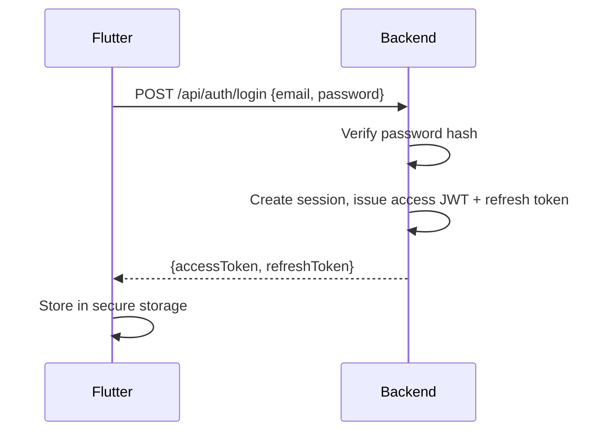
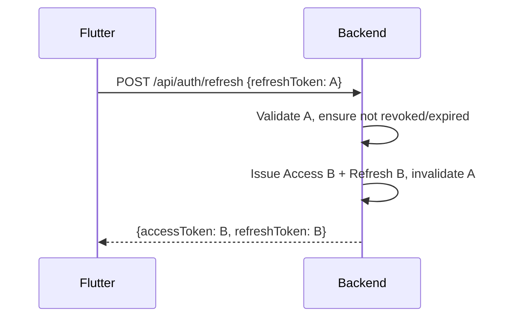

# PocketOps Detailed Technical & UX Design

## How to Use This Document
This is the implementation-level companion to `ARCHITECTURE.md`. It defines concrete API shapes, message contracts, state machines' triggering logic, and UX behavior. For structural rationale see `ARCHITECTURE.md`. For build order see `PHASES.md`. For hard constraints see `RULES.md`.

**Status: FROZEN.** Implement against this; do not redesign it.

## Domain Model

| Entity | Key Fields (conceptual) | Ownership |
|---|---|---|
| User | id, email, passwordHash (nullable if OAuth-only), githubId (nullable), createdAt | root |
| UserSession | id, userId, refreshTokenHash, deviceName, createdAt, lastUsedAt, expiresAt, revokedAt | belongs to User |
| Device | id, userId, fcmToken, platform, lastSeenAt | belongs to User |
| Infrastructure | id, userId, name, type (SELF_HOSTED/MANAGED), providerType (nullable), healthStatus, lastUpdatedAt, createdAt | belongs to User |
| Agent | id, infrastructureId, version, status, registeredAt, lastSeenAt, revokedAt | belongs to Infrastructure |
| InfrastructureResource | id, infrastructureId, externalResourceId, displayName, resourceType, status, criticality, lastSeenAt | belongs to Infrastructure |
| ProviderCredential | id, infrastructureId, encryptedPayload, createdAt | belongs to Infrastructure |
| Alert | id, infrastructureId, resourceIdentifier, severity, type, message, occurrenceCount, openedAt, acknowledgedAt, resolvedAt | belongs to Infrastructure |

Field types are conceptual; exact DB column types/lengths are an implementation detail, not a frozen decision, unless a security/architecture reason requires otherwise (e.g., secrets must be encrypted/hashed, never plaintext).

## API Design
Conceptual REST endpoint groups (MVP surface — do not expand without approval):

```
/api/auth/*                                  # register, login, github oauth callback, logout
/api/sessions/*                              # list/revoke sessions
/api/infrastructures/*                       # CRUD, list
/api/infrastructures/{id}/resources/*        # list resources, actions
/api/infrastructures/{id}/alerts/*           # list, acknowledge
/api/agents/*                                # registration endpoint (agent-facing), status
/api/providers/*                             # managed provider setup
```

Representative endpoint specs:

**POST /api/infrastructures** — Create an infrastructure (self-hosted or managed).
- Auth: required (JWT).
- Ownership: sets `userId` from the authenticated principal; never accepted from the request body.
- Request (concept): `{ name, type, providerType? }`.
- Response (concept): infrastructure object; for SELF_HOSTED, includes a one-time registration credential and install command text.
- Failure: `VALIDATION_ERROR` on bad input.

**POST /api/agents/register** — Agent-facing registration.
- Auth: one-time registration credential (not a user JWT).
- Ownership: resolves target infrastructure from the credential itself, not from any client-supplied infrastructure ID.
- Request (concept): `{ registrationToken, agentVersion }`.
- Response (concept): persistent agent identity/credential material, gRPC connection details.
- Failure: `REGISTRATION_TOKEN_INVALID` (expired, already used, or unknown).

**POST /api/infrastructures/{id}/resources/{resourceId}/actions** — Perform a destructive operation.
- Auth: required (JWT).
- Ownership: `findByIdAndUserId` at both infrastructure and resource level.
- Request (concept): `{ action: START_CONTAINER | STOP_CONTAINER | RESTART_CONTAINER }`.
- Response (concept): command acknowledgment with correlation id; actual result arrives over WebSocket.
- Failure: `AGENT_OFFLINE`, `CAPABILITY_UNSUPPORTED`, `INFRASTRUCTURE_NOT_FOUND`, `RESOURCE_NOT_FOUND`, `OPERATION_REJECTED`.

**POST /api/infrastructures/{id}/alerts/{alertId}/acknowledge**
- Auth: required (JWT). Ownership enforced. Moves alert `OPEN → ACKNOWLEDGED`.

**GET /api/infrastructures/{id}** — Manual refresh support; returns the latest authoritative snapshot known to the backend.

## Error Response Design
Consistent shape:

```json
{
  "code": "AGENT_OFFLINE",
  "message": "The agent for this infrastructure is currently offline.",
  "requestId": "..."
}
```

Stable error codes: `AGENT_OFFLINE`, `CAPABILITY_UNSUPPORTED`, `INFRASTRUCTURE_NOT_FOUND`, `RESOURCE_NOT_FOUND`, `OPERATION_REJECTED`, `PROVIDER_UNAVAILABLE`, `AUTHENTICATION_REQUIRED`, `REGISTRATION_TOKEN_INVALID`, `VALIDATION_ERROR`. No stack traces or internal exception details are ever returned to the client.

## WebSocket Design
Topics are per-infrastructure and require the same ownership check as REST before subscription is accepted, preventing cross-user event leakage. Message families:

```
MetricUpdate            { infrastructureId, resourceId, cpu, mem, netIn, netOut, ts }
ResourceStateChanged     { infrastructureId, resourceId, status, ts }
LogLine                  { infrastructureId, resourceId, line, ts }
AlertChanged              { infrastructureId, alertId, status, ts }
InfrastructureStateChanged{ infrastructureId, healthStatus, ts }
AgentStateChanged         { infrastructureId, agentStatus, ts }
```

## gRPC / Protobuf Design
Two envelope directions over one bidirectional stream:

```
AgentEnvelope   (Agent -> Backend): Heartbeat | InfrastructureSnapshot | ContainerMetric | ContainerEvent | LogEntry | CommandResult
ServerEnvelope  (Backend -> Agent): Command | ConfigAck
```

Common fields across messages: `agentId`, `infrastructureId` (where applicable), `messageId`/correlation id (for commands and their results), `timestamp`. Commands carry a `correlationId` that the eventual `CommandResult` echoes back so the backend can match results to originating REST calls. Keep the schema minimal — do not add speculative message types.

## Command Model
Allow-listed actions only: `START_CONTAINER`, `STOP_CONTAINER`, `RESTART_CONTAINER`. No generic/arbitrary command string is ever accepted at any layer.

Lifecycle: `REQUESTED → DISPATCHED → SUCCEEDED | FAILED`. Command history is not persisted beyond what is operationally necessary (e.g., correlating the in-flight request); there is no long-term command audit table required for MVP unless later explicitly approved.

## Offline Command Behavior
If the Agent is not currently ONLINE when a destructive action is requested, the backend immediately returns `AGENT_OFFLINE` and performs no queuing, retry-later, or deferred execution of any kind.

## Registration Design
The one-time registration token is:
- short-lived (bounded validity window — exact duration is a configuration default, not an architectural constant),
- single-use (invalidated atomically on first successful use),
- infrastructure-specific (bound to exactly one infrastructure record),
- never logged,
- never reusable after invalidation, expiry, or infrastructure deletion.

## Authentication Flows
Sequence for password login:



Refresh rotation:



Other flows follow the same pattern: GitHub OAuth terminates in the same session-issuance step as password login; logout revokes the current session; logout-all-devices revokes every session row for the user; an expired access token triggers a silent refresh attempt before falling back to a login prompt; a revoked refresh token forces re-authentication.

## Password Security
Use Spring Security's supported strong password hashing (e.g., BCrypt/Argon2 as configured by Spring Security defaults). No custom cryptography is implemented anywhere in the system.

## Provider Credential Design
Managed provider credentials are encrypted at rest using a key sourced from managed hosting secrets/environment configuration (never Git). Once stored, the raw credential is never returned to Flutter again — only a masked reference (e.g., "Connected") is shown.

## Infrastructure Addition UX

**Self-hosted:**
```
Add Infrastructure → Self-Hosted Docker → name environment → backend creates
PENDING infrastructure → show installer command → waiting state →
agent connects → success → dashboard
```

**Managed:**
```
Add Infrastructure → Managed → select supported provider → credential/connect
flow → capability discovery → validation → success
```

## Dashboard (Home) UX
Answers "which infrastructure needs my attention?" Layout priority: infrastructures needing attention (CRITICAL/DEGRADED/UNKNOWN) surfaced above HEALTHY ones; each card shows name, status, brief resource summary, and freshness.

## Infrastructure Detail UX
Answers "is this system healthy?" Shows overall status, list of resources with individual status, and any open alerts for the infrastructure.

## Service (Resource) Detail UX
Answers "what exactly is happening here?" Tabs/sections: **Overview** (status, criticality, last seen), **Metrics** (bounded live charts), **Logs** (live viewer), **Actions** (start/stop/restart, capability-gated).

## Metrics UX
Short, bounded rolling charts (e.g., last N minutes held in memory) — never implies permanent historical retention.

## Log Viewer UX
Live stream by default; pause/resume controls; auto-scroll toggle; inline search; copy-to-clipboard; explicit indicator of stream connection state (live vs. disconnected).

## Alerts UX
Clear visual distinction between OPEN (needs attention), ACKNOWLEDGED (seen, not yet resolved), and RESOLVED (historical). Acknowledging is a lightweight user action; resolution is system-driven.

## Critical Operation UX
Normal resource: standard confirmation dialog ("Restart execution-service?"). Critical resource: stronger dialog explicitly naming the CRITICAL classification and consequence risk (e.g., "Stopping this service may make dependent services unavailable"), still Cancel/Confirm, no arbitrary blocking of the owner's decision.

## Biometrics
Presented and labeled purely as a **device-side safety gate** protecting against accidental taps — never described or implemented as a backend authorization mechanism. Backend authorization always remains Authentication + Ownership + Authorization + Capability regardless of biometric outcome.

## Offline / Stale UX
Persistent, unmistakable stale-state banner/card replacing the live view:
```
StormAPI Production
UNKNOWN — Connection unavailable
Last confirmed: 7/7 services healthy
Last checked 4m ago
[ ↻ Refresh ]
```
Manual refresh either restores live state (`● LIVE — Updated now`) or shows a clear failure with retry (`Couldn't reach StormAPI. Showing last known state. [RETRY]`), with no unnecessary success snackbar on a plain refresh.

## Loading UX
Prefer skeleton placeholders over spinners for initial screen loads; use inline/localized loading indicators for individual actions.

## Empty States
First-run with zero infrastructures presents a clear call-to-action ("Add your first infrastructure") rather than an empty list with no guidance.

## Snackbar Usage
Reserved for transient action feedback (e.g., "Alert acknowledged"); never used to represent persistent infrastructure state such as CRITICAL or UNKNOWN.

## Widget Design
States: `LIVE-healthy`, `LIVE-degraded`, `CRITICAL`, `STALE/UNKNOWN`, `refreshing`, `refresh-failed`. Carousel behavior is manual previous/next between infrastructures — Android widget platform constraints preclude relying on continuous automatic animation or background carousel switching; the design does not fake unsupported behavior. One medium-sized widget represents the currently selected infrastructure; switching is explicit user interaction (‹ / › controls), never automatic.

## Accessibility
Adequate touch target sizes; semantic labels for screen readers; sufficient contrast; health state is always communicated with an icon/label in addition to color, never color alone.

## Fresh Light UI Design System
- **Spacing**: consistent scale, generous whitespace, calm density.
- **Cards**: subtle elevation, rounded corners, clear status affordance.
- **Typography**: clear hierarchy (title/section/body/caption), no excessive weight variation.
- **Status presentation**: icon + label + color, never color alone.
- **Icons**: consistent icon set, functional not decorative.
- **Motion**: purposeful, minimal — state transitions, not flourish.
- **Empty states**: friendly, actionable, not sparse-feeling.
Avoid cyberpunk/terminal aesthetics, excessive gradients, glassmorphism, or a generic "AI dashboard" look.

## Security UX
Raw secrets (registration tokens, provider credentials) are shown exactly once at creation and never re-displayed; subsequent views show only a masked reference or regeneration option.

## Retry / Reconnect UX
Consistent pattern across screens: automatic backoff-based reconnect attempts in the background; explicit manual "Retry" always available; UI never silently pretends a reconnect succeeded without confirming a fresh snapshot.

## Notification UX
Concise, actionable push notifications naming the infrastructure and resource; recovery notifications include duration where meaningful; no notification per individual flap cycle.

## Deep Links
Notification tap → Infrastructure screen → Service screen for the specific resource that triggered the alert.

## Data Caching Design
Locally cacheable: infrastructure metadata, last known health/resource state, last metrics snapshot, recent alerts, `lastUpdatedAt`. Never locally cached: Agent credentials, provider credentials, refresh/session secrets (these live only in secure storage where strictly required).

## Performance Design
- **Flutter**: bounded state, virtualized log lists, Riverpod selector-based rebuilds, disciplined stream disposal, bounded chart sample counts.
- **Backend**: bounded buffers, WebSocket fan-out efficiency, timeouts on all external calls, backpressure awareness, no unbounded metric writes to MySQL.
- **Agent**: small goroutine footprint, controlled sampling intervals, bounded buffers, reconnect backoff, graceful shutdown.

## Testing Strategy
- **Unit**: business logic per module (auth, infrastructure, alert lifecycle).
- **Integration**: Agent↔Backend gRPC, Backend↔Flutter WebSocket, Backend↔MySQL, FCM dispatch abstraction.
- **Backend security**: ownership/IDOR tests, JWT/refresh tests, WebSocket authorization tests.
- **Agent**: Docker abstraction tests, command allow-list tests, reconnect tests, registration tests.
- **Flutter**: widget tests, provider/state tests, offline-state UI tests, critical-action confirmation tests.
- **End-to-end happy path**: the full demo scenario from `PRD.md`.
- **Explicit security regression cases**:
  - User A cannot access User B's infrastructure.
  - User A cannot subscribe to User B's WebSocket topic.
  - A revoked refresh token fails authentication.
  - A revoked Agent cannot reconnect.
  - A used registration token cannot be reused.
  - An offline Agent's destructive command request is rejected, not queued.
  - Alert flapping does not produce a notification storm.
